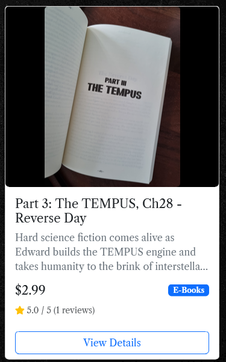

# TEMPUS Author Platform - bookshop and speculative future author blog
**Deployed website: [Link to the TEMPUS Author Platform](https://tempusap-74bb3112eef0.herokuapp.com/)**

## About
The TEMPUS Author Platform is a community-driven website for readers, writers, and futurists who share a vision for a better world. Inspired by *The Age of New Era* by Rafal Zygula, the platform offers blog articles, discussions, and a space for engaging with speculative fiction, science, and societal evolution, and a place where you can get ebooks of Valleyberg Publishing House.

## UX
The platform is designed with accessibility and user engagement in mind. Key UX principles include:
- A clean, readable interface for blog posts and discussions.
- Share and discuss content through comments
- Responsive design for optimal viewing on various devices.
- Intuitive navigation to encourage seamless interaction.
- Manage personal profiles and preferences
- Submit collaboration requests, feedback, reviews and more through forms.

### Target Audience

The platform is designed for:
- Readers of speculative fiction, science fiction and hard science fiction
- Community members interested in discussing ideas
- Users wanting to expand their knowledge on the TEMPUS topics
- People interested in what the TEPMPUS is

### User Stories

| Issue ID    | User Story |
|-------------|-------------|
|[#1](https://github.com/cptvalleyberg84/tempus-author-platform/issues/1)|As a user, I want to create an account so I can access personalized features.|
|[#2](https://github.com/cptvalleyberg84/tempus-author-platform/issues/2)|As a user, I want to log into my account so I can access my profile and purchase history.|
|[#3](https://github.com/cptvalleyberg84/tempus-author-platform/issues/3)|As an admin, I want to add products to the shop so users can browse and purchase them.|
|[#4](https://github.com/cptvalleyberg84/tempus-author-platform/issues/4)|As a user, I want to view product details so I can make informed purchase decisions.|
|[#5](https://github.com/cptvalleyberg84/tempus-author-platform/issues/5)|As a user, I want to add products to my shopping bag so I can purchase them later.|
|[#6](https://github.com/cptvalleyberg84/tempus-author-platform/issues/6)|As a user, I want to remove products from my shopping bag if I change my mind.|
|[#7](https://github.com/cptvalleyberg84/tempus-author-platform/issues/7)|As a user, I want to pay for my order securely so I can complete my purchase.|
|[#8](https://github.com/cptvalleyberg84/tempus-author-platform/issues/8)|As a user, I want to donate/pay what I want so I can support the project.|
|[#9](https://github.com/cptvalleyberg84/tempus-author-platform/issues/9)|As a user, I want to edit my profile so I can personalize my account.|
|[#10](https://github.com/cptvalleyberg84/tempus-author-platform/issues/10)|As a user, I want to view my order history so I can track my purchases.|
|[#11](https://github.com/cptvalleyberg84/tempus-author-platform/issues/11)|As an admin, I want to create blog posts so I can share updates about the project.|
|[#12](https://github.com/cptvalleyberg84/tempus-author-platform/issues/12)|As a user, I want to comment on blog posts so I can share my opinions.|
|[#13](https://github.com/cptvalleyberg84/tempus-author-platform/issues/13)|As a user, I want to leave reviews on products so I can share my experience.|
|[#14](https://github.com/cptvalleyberg84/tempus-author-platform/issues/14)|As an admin, I want to moderate reviews to ensure appropriate content.|

**Link to the Board**
[Link to the Tempus Author Platform Board on Github Projects](https://github.com/users/cptvalleyberg84/projects/5)

**Link to Milestones / EPICS**
There are 3 views available to check out at the link. The Project Board, The Project Table and the Project Roadmap. Github Milestones where used to collect User Stories and forming the Project EPICs.

[Link to the Tempus Author Platform Milestones](https://github.com/cptvalleyberg84/tempus-author-platform/milestones)

*All User stories were initially created in Microsoft TO DO*
Details in [Agile Methodology](#agile-methodology)

## Future Development

#### Third-party Websites

Related Facebook, Instagram, Linkedin and Linktree links are present in the website footer. Links to this social platforms pages are real and currently developing their reach.

#### More Details about the App future:

Considered, but out of scope has become:

- Add subscription, donations and automatic refunds handler
- Add schema.org book snippets for all works
- Add summernote or another 3rd party text editor to product description
- Add files to works section so sales can operate
- Add the 'add to cart' button in the All Works view
- Improve work details and excerpt section and integrate them to the products model
- Change google sheets newsletter to django based newsletter app
- Add that when not-logged in user buys the book - they can still register and it's known what they bought before (so they can make reviews of those works)
- Google authorization integration
- Other social media authorization integration (facebook, Microsoft etc)

---

## Technologies used
- ### Languages:

    + [Python 3.12.8](https://www.python.org/downloads/release/python-3122/): the primary language used to develop the server-side of the website.
    + [JavaScript](https://www.javascript.com/): Frontend interactivity
    + [HTML5](https://developer.mozilla.org/en-US/docs/Web/HTML): Website structure
    + [CSS3](https://developer.mozilla.org/en-US/docs/Web/css): Website styling

- ### Frameworks and libraries:

    + [Django](https://www.djangoproject.com/): Main web framework
    + [Bootstrap 5](https://getbootstrap.com/): Frontend framework
    + [jQuery](https://jquery.com/): JavaScript library for DOM manipulation
    + [Django Summernote](https://github.com/summernote/django-summernote): Rich text editor
    + [Django Allauth](https://django-allauth.readthedocs.io/): Authentication
    + [Crispy Forms](https://django-crispy-forms.readthedocs.io/): Form rendering
    + [Amazon Web Services](https://aws.amazon.com/): Media file management

- ### Databases:

    + [SQLite3](https://www.sqlite.org/): Development database
    + [PostgreSQL](https://www.postgresql.org/): Production database

- ### Primary Tools:

    + [Visual Studio Code](https://code.visualstudio.com/): the version control system used to manage the code.
    + [GitHub](https://github.com/): Code repository
    + [Chrome DevTools](https://developer.chrome.com/docs/devtools/open/): Development and debugging
    + [Firefox DevTools](https://firefox-source-docs.mozilla.org/devtools-user/): Development and debugging

- ### Deployment and Services:
    + [Gunicorn](https://gunicorn.org/): Python WSGI HTTP Server
    + [Heroku](https://www.heroku.com/): Application hosting
    + [Amazon Web Services](https://aws.amazon.com/): Media file hosting

- ### Design Tools:
    + [Font Awesome](https://fontawesome.com/): Icons
    + [Google Fonts](https://fonts.google.com/): Typography
    + [Balsamiq WireFrames](https://balsamiq.com/): App Wireframes
    + [Miro Board](https://miro.com/): Diagrams
    + [RealFaviconGenerator](https://realfavicongenerator.net/your-favicon-is-ready): Favicon
    + [tinify](https://tinypng.com/) optimizing images

- ### Other Tools:
    + [W3C Validator](https://validator.w3.org/): was used to validate HTML5 code for the website.
    + [W3C CSS validator](https://jigsaw.w3.org/css-validator/): was used to validate CSS code for the website.
    + [JShint](https://jshint.com/): was used to validate JS code for the website.
    + [PEP8](https://pep8ci.herokuapp.com/#): was used to validate Python code for the website.

---

## Features

### Access to Pages According to User Role
| Page Name | Not Logged In | Logged In User | Author/Staff | 
|-----------|---------------|----------------|--------------| 
| Home | Yes | Yes | Yes | | Login | Yes | No | No | 
| Register | Yes | No | No | 
| Logout | No | Yes | Yes | 
| View Works/Books | Yes | Yes | Yes | 
| Purchase Works | Yes* | Yes | Yes | 
| Book Cart | Yes | Yes | Yes | 
| Checkout | Yes* | Yes | Yes | 
| Add Reviews | No | Yes** | Yes** | 
| Edit Reviews | No | Yes*** | Yes*** | 
| View Blog Posts | Yes | Yes | Yes | 
| Create Blog Posts | No | No | Yes | 
| Edit Blog Posts | No | No | Yes | 
| Delete Blog Posts | No | No | Yes | 
| Add Comments | No | Yes | Yes | 
| Edit Comments | No | Yes*** | Yes | 
| Delete Comments | No | Yes*** | Yes | 
| View Profiles | Yes | Yes | Yes | 
| Edit Profile | No | Yes*** | Yes*** | 
| Order History | No | Yes*** | Yes*** |

     * Guest users can browse, add to cart and purchase, but are encouraged to register/login before purchase to be able to access their ebooks and leave reviews later
     ** Only for verfied readers who purchased works
     *** Only for own content (reviews, comments, profile)

### Main Features

#### Navigation Bar

The navigation bar is present on all pages and includes:
- Logo that redirects to the home page
- Home button to return to the main page
- Works Page to visit the shop offer
- Blog Page to view all posts, read them and leave comments
- About page
- Search bar to find posts by title or content
- Profile page (for logged-in users, after clikcing user name) containing:
  - View Profile
  - Edit Profile
  - Public Profile page (for non-logged-in users) containing containing image, bio and 3 lasts comments of another user (accessible via username click in the comments section of Blog Posts)
- Logout (for logged-in users)
- Login/Register buttons (for non-logged-in users)
- Bookcart link with badge if items are in the bookcart

    

#### Footer

Contains:
- cool TEMPUS Author Platform about statement
- Quick links - redirecting as in navbar
- Social media links "Connect with us"
- email contact adress
- Site "build by" information

#### Home Page

(in this readme part WORK and WORKS are PRODUCT and PRODUCTS)

  

- Displays 3 carousel banners
- Each carousel banner shows information in one of 4 styles
    - Works 
    - Blogposts
    - News style 
    - External Link
- Below the carousel there is LATEST UPDATES section:
    - automatically populates with latest added products (works) and blogposts
    - there's also redirection to about page "Stay Connected"
- There can be more carousel items, and they are easy to setup in the admin panel
- The "Welcome to TEMPUS Author Platform" Carousel Banner - does not have a link, when pressed it scrolls to the top of the index page (if not at the top of the page)

#### Works Page

- Displays cards with all works in the shop offer
- Each Card contain:
    - Featuring image
    - Link to the work detail
    - short info
    - price of product
    - category of product
    - rating
    - view details button

#### Work Detail Page

- Displays info about the work
    - Featuring image
    - Title of work
    - category
    - price
    - rating
    - Work Details Section:
        - pages
        - approx reading time
        - genre
        - language
        - publishing date
        - file format
    - Description of work
    - Quantity input box
    - 'add to cart button'
    - back to works button
    - Tab with:
        - Work Excerpt
        - Reviews panel
            - rating and reviews can be made by verified readers who purchased the work
            
            

            - displays all reviews and ratings with username and date

#### Blog Page

- Displays all blog posts
    - Cards with title 
    - short description 
    - author
    - date 
    - and read more button

#### Blog Post Details Page

 - Displays the post
    - feautring image
    - content styled by summernote
    - back to blog button
    - comment section
        - logged in users can leave comments
        - not logged in users can view comments and see login link

    - Comment features (CRUD):
        - Add new comments
        - Edit own comments
        - Delete own comments
        - View comment author profiles
        - Timestamps

#### Profile Page

There are 2 profile pages in total. One for logged in users - to see their own account, the other one is public - which only shows the usernamme, short bio and last made comments (accessible via username link in comments section of blogposts)

Features:
- Profile picture (if any, if not the placeholder image)
- Username
- Bio
- Editable billing information
- Recent comments

#### Bookcart

- Displays works in bookcart
    - featuring image
    - title of work with link to work detail
    - category
    - price
    - adjsuting quantity input between 1 and 99
        - increase
        - decrease
        - update button
        - remove button
    - subtotal price for the Work
    - cart total price
    - back to works button
    - Secure Checkout button

#### Checkout Page

- Displays billing adress input boxes
    - name
    - email
    - phone number
    - street adress
    - second street adress (optional)
    - city
    - postcode
    - country
- check button to save the billing info in profile for future ease of access and purchasing
- credit card input box
- go back to bookcart with "Adjust Bookcart" button
- Complete Order button
- one more grand total calculation section with the link to the work containing featuring image and title, and price total calculation

#### Checkout Success

- Displays confirmation of purchase and details of order

#### Back to top button

- present on each page at the bottom right corner in stylish red color

#### Search Functionality

- At the top information about how many resutls found in which section
- Search blog posts and works titles and descriptions
- Results displayed with previews in 2 sections: Blogs and Works
- searched phrase highlighted with yellow marker

#### Registration Page

- Displays community guidelines
- Terms of Service Modal
- Displays registration form
- Privacy Policy Modal checkbox
- Sing to a Newsletter checkbox

- Sign up button

#### Security Features

- Authentication & Authorization
    Django allauth integration for secure user authentication
    Protected routes using @login_required decorator
    Role-based access control (User/Author/Staff permissions)
    Secure password reset and email verification
    Session-based authentication
- Data Protection
    CSRF protection on all forms and AJAX requests
    Cross-Origin Resource Sharing (CORS) configuration
    Content Security Policy (CSP) implementation
    Secure password hashing using Django's auth system
    HTTPS enforcement in production
- Payment Security
    PCI-compliant Stripe integration for secure payments
    Stripe Elements for secure card input
    Payment intent verification
- Media & Storage Security
    AWS S3 for secure file storage
    Secure file upload handling
    File type validation
    Secure URL generation for media access
- User Data Protection
    User-specific content management (own profile, reviews, comments)
    Purchase verification
    Secure order history access
    Profile data encryption
- Additional Security Measures
    Custom error pages (404, 500)
    Secure cookie handling
    Rate limiting on sensitive endpoints
    Regular security updates and dependency management
    Environment variable protection for sensitive credentials

---

## E-Commerce Business Model

### Direct-to-Consumer (D2C) Author Platform

#### Core Offerings:

- Sell The Age of New Era (ebook, paperback, audiobook) directly via your website.

- Offer related works (future books, merch) and a freemium blog to drive community growth.

#### Revenue Streams:

- Book sales (direct + third-party platforms like Amazon).

- Future potential: Paid memberships for exclusive content or early access.

### Marketing Strategies

#### SEO-Driven Content:

- Optimize product pages and blog posts with pre-researched keywords (e.g., speculative fiction world development).

- Use carousel visuals and meta tags to boost organic search visibility.

#### Community-Centric Engagement:

- Convert blog readers into registered users with comment-driven discussions.

- Promote user-generated content (e.g., essays on science fiction social change).

### Multi-Platform Sales:

#### Leverage Amazon/Audible for discoverability, while directing traffic to your site via:

- Exclusive blog content (e.g., Edward Teslenstein’s scientific theories).

- Limited-time discounts for registered users.

### Social Proof & Partnerships:

- Highlight Goodreads reviews and collaborate with niche influencers (futurism/sci-fi bloggers).
- Facebook and Instagram posts to connect with readers and share your work.
- Linktree for direct links to your social media profiles.

### Email Marketing:

- Offer a free chapter download in exchange for emails to nurture leads.

## Design

### Color Scheme

The website uses a carefully selected color palette that creates a professional and engaging user experience:

- Primary Colors:
  - White - Used for navigation bar and footer backgrounds
  - Black - Used as primary background for all main content

- UI Elements:
  - Black text - on white background for optimal readability
  - White text - on black background for optimal readability
  - Red - for accents on the background cover and back to top button
  - Card Background - white base with black text
  - Link Colors - blue for normal state, darker shade for hover, sometimes black with darker blue shade on hover.
  - Buttons - primarily blue for normal state, darker shade for hover

### Typography

The website uses a clean and modern typography system:

- Primary Font: Libre Caslon Text (serif)
- Used for everything in the website as a familiar font that is used for text in the books
  - Used for brand name, headings and text
  - Weights used:
    - Light (300) for subtle text
    - Regular (400) for body text
    - Bold (700) for emphasis and headings

### Design Elements

#### Cards & Containers
- **Work & Blog Cards**
  - Elegant hover effects with subtle elevation
  - Box shadow: `0 2px 5px rgba(0,0,0,0.1)`
  - Smooth transition animations
  - Clean typography using Libre Caslon Text
  - Consistent padding (1.5rem)

#### Images & Media
- **Responsive Image Handling**
  - Dynamic image containers with flex positioning
  - Work images: 300px height with center alignment
  - Blog images: 200px height with cover fitting
  - Background image with fixed positioning
  - Optimized loading with lazy loading

#### Interactive Elements
- **Navigation & Links**
  - Smooth hover transitions (0.3s ease)
  - Custom color scheme (accent: #882222)
  - Social media links with hover effects
  - Clear active states

- **Buttons & Forms**
  - Bootstrap-based button styling
  - Custom form styling with clear focus states
  - Stripe Elements integration for payment forms
  - Consistent input padding (10px 12px)

- **User Feedback**
  - Toast messages for system notifications
  - Form validation feedback
  - Loading states for async operations
  - Error state visualization

#### Layout & Structure
- **Grid System**
  - Bootstrap 5 responsive grid
  - Custom breakpoints for optimal viewing
  - Flexible container widths
  - Responsive padding adjustments

- **Page Structure**
  - Fixed header with 72px top padding
  - Full-height hero sections
  - Responsive sidebar navigation
  - Footer with social links

### Responsive Design

#### Core Principles
- **Mobile-First Implementation**
  - Bootstrap 5 grid system
  - Responsive breakpoints:
    - Small devices (≥576px)
    - Medium devices (≥768px)
    - Large devices (≥992px)
    - Extra large (≥1200px)
  - Fluid container widths

#### Adaptive Elements
- **Navigation**
  - Collapsible navbar with hamburger menu
  - Dropdown menus for mobile
  - Fixed top navigation
  - Responsive search bar

- **Images & Media**
  - Flexible image containers with aspect ratios
  - Responsive background images
  - Dynamic image scaling
  - Optimized loading for mobile

- **Typography**
  - Responsive font sizes using rem units
  - Adjustable line heights
  - Readable text at all breakpoints
  - Dynamic heading scales

#### Layout Adaptations
- **Grid System**
  - Column reordering on different screens
  - Responsive margins and padding
  - Flexible card layouts
  - Adaptive sidebar

- **Content Organization**
  - Stack view on mobile devices
  - Horizontal scrolling for tables
  - Collapsible sections
  - Touch-friendly interactions

#### User Experience
- **Interactive Elements**
  - Touch-friendly buttons (min 44px)
  - Swipe gestures support
  - Mobile-optimized forms
  - Visible focus states

This responsive design system ensures that Tempus Author Platform provides an optimal viewing and interaction experience across a wide range of devices, from mobile phones to desktop computers, while maintaining consistent branding and functionality.

### Imagery

- The main logo uses Libre Caslon Text font as base just as in the book. 
- Featuring images were designed by Book Cover Artist - Rodchenko with [Fiverr](https://www.fiverr.com/)
- The image featuring the Jester is created using Photoshop by blending elements from an old Polish painting called "Stańczyk" by Jan Matejko. Notably, the book image is inserted in the lower-left corner. This artwork holds significant meaning, especially in relation to the themes of the book and platform, focusing on the state of our civilization, hence why we can see the Earth through the spaceship window. The historical context of the painting aptly represents these topics.

- Used some icons from the [font awesome](https://fontawesome.com/) website. Icons are essential for the user experience when it comes to multifunctional websites.

### Wireframes

  [TEMPUS Author Platform Wireframes](documentation/design/TAP-the-author-platform.pdf)

---

## Agile Methodology

### GitHub Project Management

GitHub Project Management was used to manage the project.

[TEMPUS Author Platform Project Board](https://github.com/users/cptvalleyberg84/projects/5)

The Project Board:

The Project Roadmap:

Some User Stories were also collected into EPICS using the GitHub Milestones:

### Other Software

To track ideas and bugs during development, Microsoft TO DO was utilized as a lightweight task management tool.
Its quick and easy interface proved valuable, though it was adapted to fit the project's in-house methods, styling, and documentation needs.

  

## Flowcharts

To understand how to begin I created a flowchart ERD using MIRO Board.

[Flowchart](documentation/images/image-17.png)

---

## Information Architecture

### Database
- Development: SQLite3 database
- Production: PostgreSQL database
- Django's ORM for database operations
- Implements proper foreign key relationships with CASCADE/SET_NULL deletion rules
- AWS S3 for media file storage

### Data Modeling

#### Product/Work Model
| Name | Database Key | Field Type | Validation |
|------|--------------|------------|------------|
| Category | category | ForeignKey(Category) | null=True, on_delete=SET_NULL |
| Name | name | CharField | max_length=255 |
| Description | description | TextField | Required |
| Price | price | DecimalField | max_digits=9, decimal_places=2 |
| Created Date | created_date | DateTimeField | auto_now_add=True |
| Updated Date | updated_date | DateTimeField | auto_now=True |
| Image | image | ImageField | upload_to='products/', null=True |
| Image URL | image_url | URLField | max_length=1024, null=True |

#### Review Model
| Name | Database Key | Field Type | Validation |
|------|--------------|------------|------------|
| Product | product | ForeignKey(Product) | on_delete=CASCADE |
| User | user | ForeignKey(User) | on_delete=CASCADE |
| Rating | rating | IntegerField | choices=[1-5] |
| Comment | comment | TextField | null=True, blank=True |
| Created Date | created_date | DateTimeField | auto_now_add=True |
| Approved | approved | BooleanField | default=False |

#### UserProfile Model
| Name | Database Key | Field Type | Validation |
|------|--------------|------------|------------|
| User | user | OneToOneField(User) | on_delete=CASCADE |
| Full Name | profile_full_name | CharField | max_length=50, null=True |
| Email | profile_email | EmailField | null=True |
| Phone Number | profile_phone_number | CharField | max_length=20, null=True |
| Address Line 1 | profile_address1 | CharField | max_length=255 |
| Address Line 2 | profile_address2 | CharField | max_length=255, null=True |
| City | profile_city | CharField | max_length=100, null=True |
| Postcode | profile_postcode | CharField | max_length=6, regex validation |
| Country | profile_country | CountryField | max_length=2, null=True |
| Profile Image | profile_image | ImageField | upload_to='profile_images/' |
| Bio | profile_bio | TextField | max_length=500, blank=True |
| Created Date | profile_created | DateTimeField | auto_now_add=True |
| Updated Date | profile_updated | DateTimeField | auto_now=True |

#### Order Model
| Name | Database Key | Field Type | Validation |
|------|--------------|------------|------------|
| User Profile | user_profile | ForeignKey(UserProfile) | null=True, on_delete=SET_NULL |
| User | user | ForeignKey(User) | null=True, on_delete=SET_NULL |
| Total Amount | total_amount | DecimalField | max_digits=10, decimal_places=2 |
| Order Date | order_date | DateTimeField | auto_now_add=True |
| Full Name | full_name | CharField | max_length=50 |
| Email | email | EmailField | Required |
| Phone Number | phone_number | CharField | max_length=20 |
| Address Line 1 | billing_address1 | CharField | max_length=255 |
| Address Line 2 | billing_address2 | CharField | max_length=255, null=True |
| City | billing_city | CharField | max_length=100 |
| Postcode | billing_postcode | CharField | max_length=20 |
| Country | billing_country | CharField | max_length=100 |

### Model Relationships

1. User Model (Django Built-in)
   - One-to-Many with Posts (as author, related_name='blog_posts')
   - One-to-Many with Comments (as author, related_name='blog_comments')
   - One-to-One with UserProfile
   - One-to-Many with Reviews (for products)
   - One-to-Many with Orders (related_name='user_orders')

2. Post Model
   - Many-to-One with User (author, limited to is_staff=True)
   - One-to-Many with Comments (related_name='comments')
   - Featured image handling
   - Status tracking (Draft/Published)

3. Comment Model
   - Many-to-One with User (author)
   - Many-to-One with Post (related_name='comments')
   - Active status tracking
   - Timestamps (created_on, updated_at)

4. UserProfile Model
   - One-to-One with User (CASCADE deletion)
   - One-to-Many with Orders (related_name='orders')
   - Extended user information (address, contact details)
   - Profile image and bio

5. Product Model
   - Many-to-One with Category
   - One-to-Many with Reviews (related_name='reviews')
   - One-to-Many with OrderItems
   - Image and pricing information

6. Order Model
   - Many-to-One with UserProfile (SET_NULL)
   - Many-to-One with User (SET_NULL)
   - One-to-Many with OrderItems
   - Billing and shipping information

### Key Features
- Automatic slug generation for posts
- Image handling through ImageField with specific upload paths:
  - Blog: 'blog/featured_images/%Y/'
  - Products: 'products/'
  - Profiles: 'profile_images/'
  - Carousel: 'carousel/'
- Draft/Published post status system (0: Draft, 1: Published)
- Comment system with activation control
- Review system for products with:
  - Rating (1-5 scale)
  - Comment support
  - Approval system
  - One review per user per product constraint
- User profile system with:
  - Custom fields for contact information
  - Address management
  - Profile image with default
  - Bio support
- Order management with:
  - Multiple items per order
  - Automatic price calculation
  - Payment status tracking
  - Billing information storage
- Category management for products
- Carousel system for featured content with:
  - Multiple style options
  - Date-based activation
  - External link support

---

## Testing

Please refer to the [TESTING.md](documentation/testing/TESTING.md) file for all test-related documentation.

---

## Deployment

- The app was deployed with [Heroku](https://www.heroku.com/).

- The database was made with [PostgreSQL from Code Institute](https://dbs.ci-dbs.net/).

- The app can be reached by the [link](https://tempusap-74bb3112eef0.herokuapp.com/).

Please refer to the [DEPLOYMENT.md](documentation/deployment/DEPLOYMENT.md) file for all of the deployment documentation.

---

## Credits

- [GitHub](https://github.com/) for storing the whole project in one place
- [Gitpod](https://www.gitpod.io/) for helping writing the code
- [Django](https://www.djangoproject.com/) for the framework.
- [Font awesome](https://fontawesome.com/): for the free access to icons.
- [favicon.io](https://favicon.io/favicon-converter/) helped creating favicons
- [Code Institute - Developing with Django Content](https://learn.codeinstitute.net/courses/course-v1:CodeInstitute+EA101+6/courseware/eb05f06e62c64ac89823cc956fcd8191/3adff2bf4a78469db72c5330b1afa836/) for putting the basics on the table
- [PageSpeed](https://pagespeed.web.dev/) for providing detailed measurements for the TEMPUS Author Platform
- [Django ORM Cheatsheet](https://djangocentral.com/django-orm-cheatsheet/#:~:text=Django%2C%20as%20a%20powerful%20and,involved%20in%20working%20with%20databases.) for providing guidance in the beginning of working on this project
- [Django Search Tutorial](https://learndjango.com/tutorials/django-search-tutorial) for providing guidance how to work out the search bar
- [Making queries](https://docs.djangoproject.com/en/4.0/topics/db/queries/) for helpilng to comprehend queries
- [Design philosophies](https://docs.djangoproject.com/en/4.2/misc/design-philosophies/) for showing me fundaments of good coding in django
- [Writing views](https://docs.djangoproject.com/en/3.2/topics/http/views/#customizing-error-views) for details about writing views including proper implementation of handler404
- [crispy-bootstrap5 2024.10](https://pypi.org/project/crispy-bootstrap5/) for helping creating forms faster
- [Stripe Web Elements](https://docs.stripe.com/payments/elements) for providing secure user-ready input box for credit card details
- [Bootstrap Documentation](https://getbootstrap.com/docs/5.3/components/navbar/#responsive-behaviors) for helping easily design navigation bar
- [Bootstrap Documentation](https://getbootstrap.com/docs/5.3/components/card/#example) for helping easily design cards 
- [Bootstrap Documentation](https://getbootstrap.com/docs/5.3/components/toasts/) for helping easily implement quality responsiveness and taost messages
- [Storing Shopping Carts in Sessions | Part-4 | Django Project](https://www.youtube.com/watch?v=UMKKQQcPH_A) for helping understand session based shopping cart
- [Customer Sessions Shopping Cart - Django Wednesdays ECommerce 12](https://www.youtube.com/watch?v=G8Z54xUGlo4) further expanding knowledge about session based shopping cart
- [Django Blog App – Add Bloging and Commenting to Your Django App](https://www.askpython.com/django/django-blog-app) info about how to properly setup the blog
- [Redirect back to previous page after login in django-allauth](https://stackoverflow.com/questions/63886066/redirect-back-to-previous-page-after-login-in-django-allauth) to help solve redireciton issue
- [Why does my default django admin page look terrible when deployed to heroku?](https://stackoverflow.com/questions/70926717/why-does-my-default-django-admin-page-look-terrible-when-deployed-to-heroku) Heroku connection was much more difficult this time than I thought
- [Direct to S3 File Uploads in Python](https://devcenter.heroku.com/articles/s3-upload-python) for sheding light on how S3 collaborates with heroku
- [Django and Static Assets](https://devcenter.heroku.com/articles/django-assets) helping in dark moments of connection between S3 and Heroku
- [python-getting-started/gettingstarted/settings.py](https://github.com/heroku/python-getting-started/blob/main/gettingstarted/settings.py) to keep hope and try to udnerstand if my settings are correct
- [Best Practice to prevent form abuse Django](https://stackoverflow.com/questions/70365566/best-practice-to-prevent-form-abuse-django) to help setup nice validation to help fill out forms correctly
- [Carousel: How to create a testimonial carousel with HTML, CSS, and Javascript.](https://dev.to/ediomojose/carousel-how-to-create-a-testimonial-carousel-with-html-css-and-javascript-43j6) Start of journey into carousel (which is nice with Bootstrap!)
- [Access-Control-Allow-Origin response with ETag](https://stackoverflow.com/questions/69673929/access-control-allow-origin-response-with-etag-header-seems-to-be-getting-cached) trying to udnerstand if my setup is correct
- [Django E-commerce Website Frontend (Part 1)](https://medium.com/analytics-vidhya/django-e-commerce-website-frontend-part-1-ad007696ceba) more good practices about ecommerce and django
- [Cross-Origin Resource Sharing (CORS)](https://developer.mozilla.org/en-US/docs/Web/HTTP/CORS)
- [How to highlight a keyword in a Django search using a custom filter?](https://medium.com/geekculture/how-to-highlight-a-keyword-inside-a-text-in-a-django-search-6a8e33cc8496) for helping create highlighted search results 
- [Highlighting](https://django-haystack.readthedocs.io/en/master/highlighting.html) more detailed info about highlighting text
- [Back to Top button with JS](https://stackoverflow.com/questions/54581977/back-to-top-button-with-js) For helping creating Back to Top button
- [Django Login, Logout, Signup, Password Change, and Password Reset](https://learndjango.com/tutorials/django-login-and-logout-tutorial) to understand what django has in its rep
- [Mobile Carousel Best Practices That Designers Should Know](https://www.sliderrevolution.com/design/mobile-carousel/) more info about carousels
- [Bootstrap Carousel](https://getbootstrap.com/docs/5.3/components/carousel/) This is a great tool to easily setup carousel
- [API-based carousel using Django](https://www.geeksforgeeks.org/how-to-make-an-api-based-carousel-using-django/) considering design of carousel and scoping it
- [Browser not using metatag Content Security Policy](https://stackoverflow.com/questions/41345827/browser-not-using-metatag-content-security-policy) to solve issues with S3 connection
- [django-csp 3.8](https://pypi.org/project/django-csp/) important support for django
- [How To Secure Your Django Application with a Content Security Policy](https://www.digitalocean.com/community/tutorials/how-to-secure-your-django-application-with-a-content-security-policy) to provide more information about CSP 
- 
- 
- 
- [Create a Python User() class that both creates new users and modifies existing users](https://stackoverflow.com/questions/2521907/create-a-python-user-class-that-both-creates-new-users-and-modifies-existing-u) to help understand if guest user can have a validated purchase after the purchase was done not logged it
- [Privacy Policy Generator](https://www.privacypolicygenerator.info/) For helping creating a reasonable policy

---

## Acknowledgments

I wish to thank all the authors of websites and forums which I visited briefly to grasp the essence of my issues with the code, which ultimately helped me create the TEMPUS Author Platform, however I lost the links in the sands of time and pursue for making the thing working correctly.

I'd wish to thank also the Code Institute's, Student's Support - The Tutor Assitance Team that bravely led me towards realising how the code works.

and one and only:
- [Iuliia Konovalova](https://github.com/IuliiaKonovalova) for sharing her passion for coding with me, and guiding through this amazingly complex process of absorbing knowledge on how to do django correctly. Thank you for directing me to the right path Iullia!