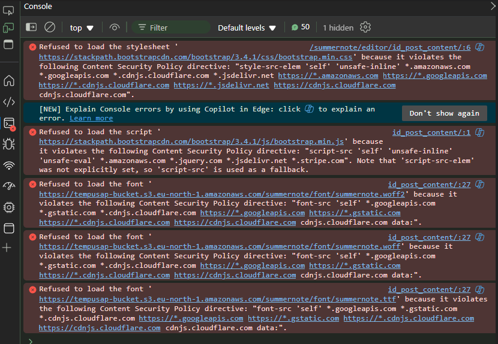
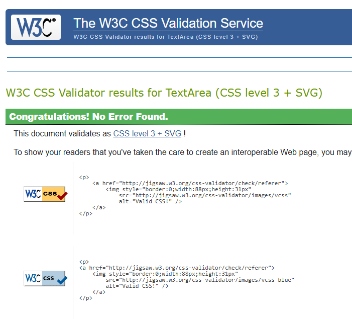
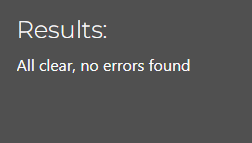
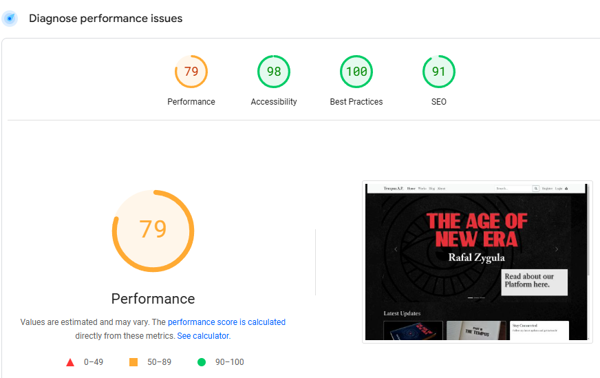
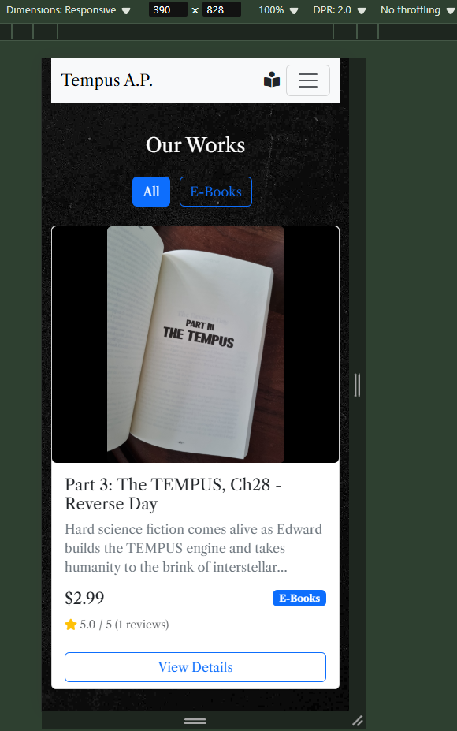

## Testing

### Manual Testing

Testing was conducted throughout the development process for each feature before merging into the main codebase.

#### User Authentication & Profile Tests

| Page | User Actions | Expected Results | Y/N | Comments |
|------|--------------|------------------|-----|----------|
| Sign Up |  |  |  |  |
| 1 | Click on Register button | Redirects to registration page | Y | Includes terms acceptance |
| 2 | Enter username | Field accepts alphanumeric characters | Y | Checks for unique username |
| 3 | Enter email | Field validates email format | Y | Sends verification email |
| 4 | Enter password | Field accepts valid password format | Y | Shows password strength indicator |
| 5 | Click Sign Up | If sign to newsletter checked | Y | Sign-ups to the newsletter and continues registration |
| 6 | Click Sign Up | Creates account and sends verification email | Y | Redirects to verification page |
| Profile |  |  |  |  |
| 1 | Click on Profile | Redirects to user profile page | Y | Shows order history tab |
| 2 | Upload profile picture | Image uploads to AWS S3 | Y | Generates thumbnail version |
| 3 | Edit bio and contact info | Information saves and updates | Y | Validates phone format |
| 4 | View purchase history | Shows list of past orders | Y | Shows order history |

#### Product Management Tests (Staff Only)

| Page | User Actions | Expected Results | Y/N | Comments |
|------|--------------|------------------|-----|----------|
| Create Product |  |  |  |  |
| 1 | Click Add Product | Opens product creation form | Y | Staff access only |
| 2 | Enter product details | Fields validate required info | Y | Price format validation |
| 3 | Upload product image | Image uploads to AWS S3 | Y | N/A |
| 4 | Save product | Product appears in store | Y | N/A |
| Edit Product |  |  |  |  |
| 1 | Click Edit Product | Opens edit form | Y | Shows current values |
| 2 | Modify price/details | Changes save correctly | Y | N/A |
| 3 | Update images | New images upload to AWS S3 | Y | N/A |

#### Shopping Cart & Checkout Tests

| Page | User Actions | Expected Results | Y/N | Comments |
|------|--------------|------------------|-----|----------|
| Cart Management |  |  |  |  |
| 1 | Add item to cart | Item appears with correct price | Y | Shows cart total |
| 2 | Adjust quantity | Price updates after clicking update| Y | N/A |
| 3 | Remove item | Item removes from cart | Y | Updates total price |
| 4 | Proceed to checkout | Opens secure checkout | Y | Stripe integration |
| Checkout |  |  |  |  |
| 1 | Enter shipping info | Validates address format | Y | Saves for future use when option checked and user logged in|
| 2 | Enter payment info | Processes via Stripe | Y | Shows secure badge |
| 3 | Complete purchase | Creates order confirmation | Y | Sends email receipt |
| 4 | View order status | Shows tracking information | Y | Updates in real-time |

### Testing User Stories

| User Story | Requirement met | Image |
|------------|----------------|-------|
| As a customer, I want to easily browse and purchase products | Y | [Works Page] |
| As a user, I want to create an account to track my orders | Y | [Order history page] |
| As a staff member, I want to manage product inventory | Y | [Product management dashboard] |
| As a customer, I want to save my shipping addresses | Y | [Profile Page] |
| As a user, I want to view my purchase history | Y | [Order history view] |
| As a staff member, I want to process orders efficiently | Y | [Order processing interface] |
| As a customer, I want secure payment processing | Y | [Stripe checkout page] |
| As a user, I want to manage my profile and preferences | Y | [Account settings page] |

#### Security and Performance Tests

| Test Type | Test Case | Expected Results | Y/N | Comments |
|-----------|-----------|------------------|-----|----------|
| Payment Security | Process test payment | Stripe test transaction succeeds | Y | Uses test API keys |
| CSRF Protection | Form submission | Validates CSRF token | Y | All forms protected |

## Bugs (problematic above average)

### Solved Bugs

1. S3 Image Upload Failures and CORS/Staticfiles Misconfiguration
Description:
When creating posts on the TEMPUS Author Platform, image uploads to Amazon S3 were failing despite initial tests (simple S3 uploads) working fine. The problem manifested only when trying to integrate S3 for dynamic content on Heroku. Users reported that images did not appear on posts, causing broken media links on the live site.

Root Causes Identified:

Bucket Policy Issues: The S3 bucket policy was not providing the correct permissions.
CORS Setup: The CORS configuration was misconfigured, preventing cross-origin requests from Heroku from accessing S3 resources.
Static and Media Settings: The previous configuration for STATICFILES_STORAGE, AWS_S3_CUSTOM_DOMAIN, and related settings was not correctly structured.
Content Security Policy (CSP): Missing CSP settings further restricted resource loading.

Solution Implemented:

Updated the bucket policy to ensure proper public-read permissions.
Revised the CORS settings to allow the necessary origins and headers.
And clearning settings.py to state of commit "Fix AWS S3 images upload"

2. Book Cart Quantity Controls Inconsistencies
Description:
The book cart quantity controls exhibited inconsistent behavior. The issues included:

The update button not working on larger screens
Quantity validation functioning only for the first product
Browser default number input spinners causing visual inconsistency
Root Causes Identified:
Investigation revealed that the update button was positioned outside the form in some cases, leading to inconsistent behavior on larger screens. Additionally, the JavaScript validation was only targeting the first product's quantity, and the browser’s native number input spinners disrupted the visual design.

Solution Implemented:

Form Structure Adjustment:
Moved the update button inside the form to ensure consistent form submission across all screen sizes.
JavaScript Quantity Validation:
Implemented vanilla JavaScript to validate the quantity within a 1–99 range, ensuring proper validation for all products.
CSS Adjustments:
Added custom CSS to remove the browser’s default number input spinners.

### Known Bugs

No known bugs.

### Validation

#### HTML Validation
All pages were validated using the [W3C HTML Validator](https://validator.w3.org/) through both URL checking and direct input of source code:

- Index Page: No errors

    - [example: Home Page Image Direct Text Input Test](image-2.png)

- Profile Page: No errors
- Blog - No errors
- Blog Post Detail Page: Errors made by summernote text editor text generation may appear in specific blogposts. (if generated content was copied from older blogposts or articles (written by author, taken from archives))
- Works - No errors
- Work Details - Error generated by django text editor adding extra paragraph closing tag:  "No p element in scope but a p end tag seen."
- Checkout Page: Error generated by django-countries (not allowed placeholder "Country *")
- About Page: No errors
- Search Results: No errors
- Profile Page: Error generated by crispy forms "Attribute placeholder is only allowed when the input type is email, number, password, search, tel, text, or url"
- Public Profile Page: No errors

#### CSS Validation
CSS validation was performed using the [W3C CSS Validator](https://jigsaw.w3.org/css-validator/):

All files passed validation:
- No errors
- All vendor prefixes validated
- No unused CSS rules

#### JavaScript Validation
All JavaScript code has been validated using [JSHint](https://jshint.com/):

No errors found

#### Python Validation
Python code was validated using [CI Python Linter](https://pep8ci.herokuapp.com/#):

### Additional Testing

1. Responsive Design Testing:
   - Tested across multiple devices:
     - Mobile: iPhone SE, iPhone XR, iPhone 12 Pro, Samsung Galaxy S20
     - Tablet: iPad Air, iPad Mini
     - Desktop: 1080p and 1440p monitors
   - Verified responsive breakpoints:
     - Mobile: 320px - 480px
     - Tablet: 481px - 768px
     - Desktop: 769px and above
   - Confirmed proper scaling and layout for:
     - Product cards in the store
     - Blog post layouts
     - Navigation menu
     - Profile management forms
     - Shopping cart interface

2. Browser Compatibility:
   PC Testing:
   - Google Chrome (Version 121.0)
   - Mozilla Firefox (Version 122.0)
   - Microsoft Edge (Version 121.0)
   
   Mobile Testing (Android):
   - Chrome Mobile
   - Samsung Internet
   - Firefox Mobile

3. Functional Testing:
   - E-commerce Features:
     - Shopping cart functionality
     - Checkout process
     - Order confirmation
     - Product review system
   - Blog Features:
     - Post creation and editing
     - Comment system
     - Content formatting
   - User Profile:
     - Profile creation
     - Information updates
     - Order history display
   - Admin Features:
     - Product management
     - Order processing
     - User management
     - Content moderation

4. Content Testing:
   - Verified all internal links
   - Confirmed external links open in new tabs
   - Checked for broken images
   - Validated form error messages
   - Tested success/error notifications
   - Verified email template rendering

### Website Performance Reports

Performance analysis indicates potential improvements, particularly regarding image sizes. While testing was conducted with family and friends, results suggest implementing an automated image size reduction process could benefit the platform, however the image quality is marketing-wise important.

## Responsiveness

Responsiveness was continuously monitored during development using Chrome DevTools.

### Index Page:

### Work Details Page:

## End of Report